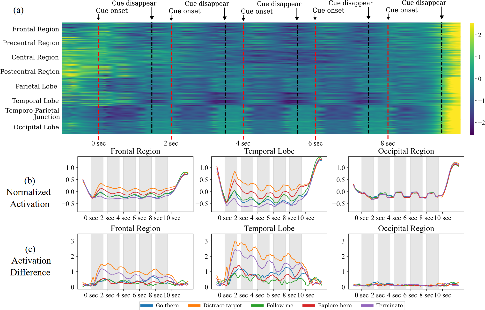
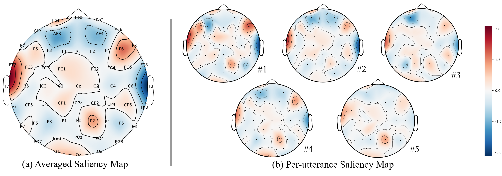
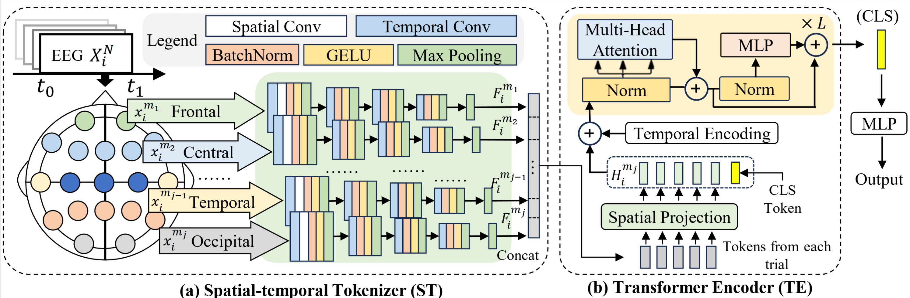
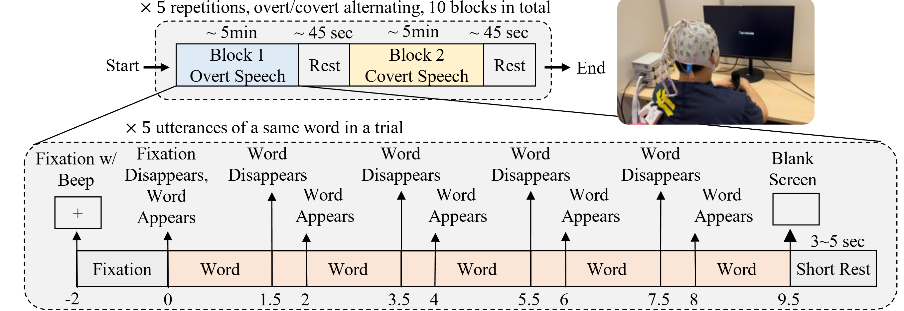

# FAST: Functional Areas Spatio-Temporal Transformer

[](https://doi.org/10.1109/JBHI.2026.3653025)

**Decoding Covert Speech from EEG by Functional Areas Spatio-Temporal Transformer**

*Muyun Jiang, Wei Zhang, Yi Ding, Kok Ann Colin Teo, LaiGuan Fong, Shuailei Zhang, Zhiwei Guo, Chenyu Liu, Raghavan Bhuvanakantham, Wei Khang Jeremy Sim, et al.*

*IEEE Journal of Biomedical and Health Informatics, 2026*

---

## What is Covert Speech Decoding?

Covert speech (imagined speech) is the internal experience of articulating words silently — thinking in language without any audible output or visible movement. Decoding these neural signals from EEG (electroencephalogram) could unlock hands-free, non-invasive brain-computer interfaces (BCIs), with transformative potential for people living with paralysis, ALS, stroke, or other communication impairments.

EEG-based covert speech decoding is notoriously hard: the signals are weak, noisy, and highly variable across individuals. FAST addresses these challenges with a brain-inspired architecture that reasons about *where* in the brain speech is happening, not just *when*.

---

### EEG Feature Activations



*Time-frequency heatmaps of learned features across brain regions. Frontal and temporal regions show strong, discriminative responses at word cue onset, while occipital regions respond visually but do not contribute to word identity classification.*

### Electrode Importance (Saliency Maps)



*Integrated gradients reveal that the model relies heavily on left-hemisphere electrodes — particularly around Broca's area (T7, FT7, FC5, C5, F5) — consistent with known speech motor planning and phonological processing regions. Activation diminishes across successive utterances as the brain requires less cognitive effort for repeated words.*

---

## Method

FAST consists of two core components:

- **Spatial-temporal Tokenizer (ST)**: Divides the scalp electrodes into 8 functional brain regions (frontal, temporal, parietal, occipital, etc.) and extracts region-specific features using convolutional layers — creating a structured, neurologically meaningful token for each area.
- **Transformer Encoder (TE)**: Processes these regional tokens through spatial projection and stacked transformer blocks to capture both spatial dependencies across brain areas and temporal dynamics across time.

The model is trained in two stages: **LOSO pre-training** (leave-one-subject-out) to learn generalizable cross-subject representations, followed by **LOBO fine-tuning** (leave-one-block-out) to adapt to individual subjects.

### Network Architecture



*Overview of the FAST architecture. The Spatial-temporal Tokenizer partitions scalp electrodes into functional brain regions and extracts region-specific convolutional features, which are then processed by the Transformer Encoder to model cross-region spatial dependencies and temporal dynamics.*

### Experimental Protocol



*Subjects performed 10 blocks of speech (5 overt, 5 covert), repeating 5 target words ("Go there", "Distract Target", "Follow me", "Explore Here", "Terminate") across multiple utterances per trial. EEG was recorded at 64 channels / 5,000 Hz.*

---

## Results

| Dataset | Accuracy | F1 | vs. Best Baseline |
|---|---|---|---|
| Private (covert, fine-tuned) | **34.7 ± 10.7%** | 0.340 | +3.5% over TSception |
| BCI Competition 2020 Track 3 | **54.8 ± 9.1%** | — | +2.6% over TSception |

Chance level is 20% for 5-class classification. Using multiple utterances per trial progressively improves accuracy (28.4% with 1 → 34.7% with 5), as averaging reduces noise.

---

## Quick Start

### Dataset Preparation

Download the BCI Competition 2020 Track 3 dataset from [https://osf.io/pq7vb/](https://osf.io/pq7vb/) and place it in the `BCIC2020Track3/` directory:

```
BCIC2020Track3/
├── Training set/
│   ├── Data_Sample01.mat
│   ├── Data_Sample02.mat
│   └── ...
├── Validation set/
│   ├── Data_Sample01.mat
│   ├── Data_Sample02.mat
│   └── ...
```

### Preprocessing

```bash
python BCIC2020Track3_preprocess.py
```

Processed data will be saved to `Processed/BCIC2020Track3.h5`.

### Training

```bash
python3 BCIC2020Track3_train.py --gpu 0 --folds "0-15"
# Multi-GPU:
# bash BCIC2020Track3_run.sh
```

Results are saved to `Results/FAST/` and printed automatically after training.

---

## Citation

If you find this work useful, please cite:

```bibtex
@article{jiang2026decoding,
  title={Decoding Covert Speech from EEG by Functional Areas Spatio-Temporal Transformer},
  author={Jiang, Muyun and Zhang, Wei and Ding, Yi and Teo, Kok Ann Colin and Fong, LaiGuan and Zhang, Shuailei and Guo, Zhiwei and Liu, Chenyu and Bhuvanakantham, Raghavan and Sim, Wei Khang Jeremy and others},
  journal={IEEE Journal of Biomedical and Health Informatics},
  year={2026},
  publisher={IEEE}
}
```
